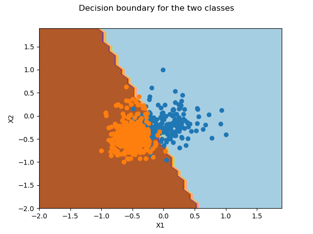

# ES654-2020 Assignment 3

*Pushkar Mujumdar* - *18110132*

------

> Implemented Unregularized logistic regression for 2 classes using manually calculated gradients as well as Autograd 

### Breast Cancer Dataset

Following are the results for ```Manual``` gradient calculation:  
```
[config] n_iter = 200
3-fold Cross Validation:

Accuracies:
[0.8888888888888888, 0.9578947368421052, 0.968421052631579]

Best Accuracy:  0.968421052631579
```

Following are the results for ```Autograd``` gradient calculation:
```
[config] n_iter = 200
3-fold Cross Validation:

Accuracies:
[0.8888888888888888, 0.9578947368421052, 0.968421052631579]

Best Accuracy:  0.968421052631579
```

Decision Boundary on 2 features:

