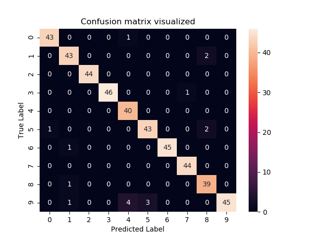
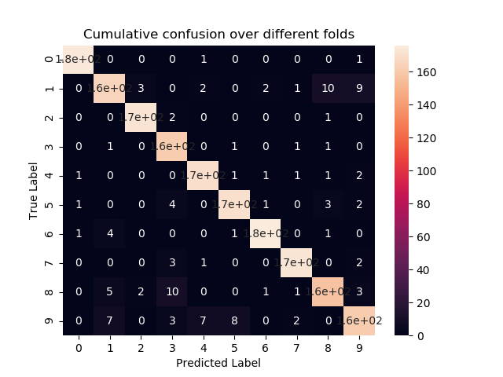
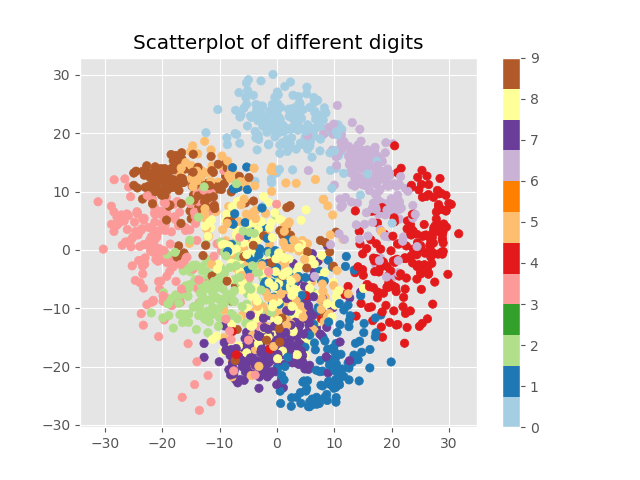

# ES654-2021 Assignment 3

*Pushkar Mujumdar* - *18110132*

------

> Implemented K-class Logistic Regression using manual update rules as well as Autograd

---

### Digits Dataset Classification Performance

- Following are the results for Stratified K-fold (4 folds)
```
The accuracies over the folds:
[0.9466666666666667, 0.910913140311804, 0.9621380846325167, 0.9220489977728286]

Overall Best accuracy:  0.9621380846325167
```

- Visualizing Confusion Matrix



- Visualizing Cumulative Confusion Matrix over the Folds



```
Number of times ith digit was misclassified:
[ 2. 27.  3.  4.  7. 11.  7.  6. 22. 27.]

From the above results, we can see that 1, 8 and 9 were the most misclassified digits

From the cumulative confusion matrix, we can see that 8 was often misclassified as 3 which is pretty intuitive. 
1 was misclassified as 9 and vice versa is also understandable.
```

- Visualizing digits dataset in 2d after PCA transform



- Conclusions from the above plot:
    - Digits which look similar like 1 and 7 have their embeddings closer to each other
    - We can see that the digits 8 and 3 almost overlap in the plot which is intuitive as they look similar
    - However, 1 and 9 which were confused by our Neural network are plotted far from each other, because some features might have been lost in reducing the dimmentions from 64 to 2
